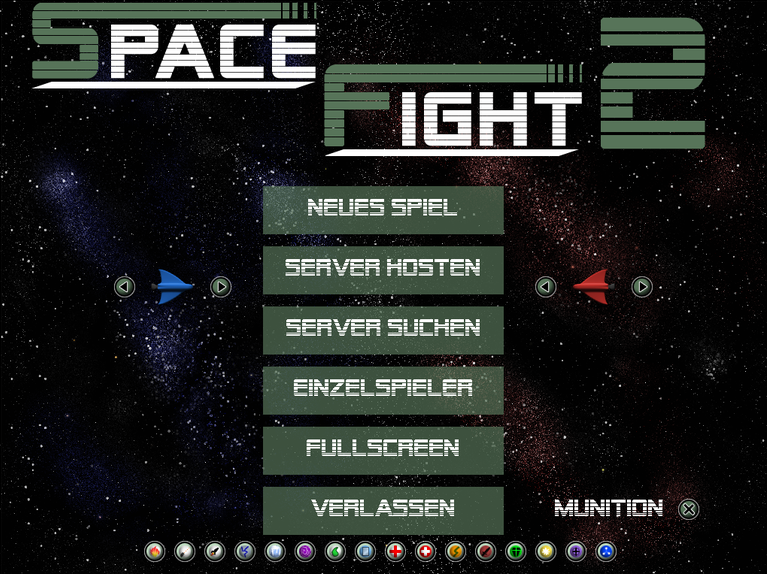

# SpaceFight2

## History

When I learned programming back in the days, I often implemented small 2D games to learn new graphics frameworks.
*SpaceFight* is a game I have written about four times.
This here is version 2 written in C++ and SDL using DevC++.
This version dates back to august 2010 when I was 17 years old.
I updated it slightly to compile with a modern GCC.
A simple *make* should build it on Linux, for Windows there are binaries in *windows/SF2.zip*.

## Gameplay

Two space ships face each other.
Each player has to shoot its enemy until their lives drop to zero.
Ammunition is limited, but new weapons, as well as buffs (e.g. for healing) spawn on the battlefield.
You may enter your enemy's side, but you will lose life over time.

### Controls

Left player: WASD to move, Space to shoot

Right player: Arrow keys to move, numpad 0 to shoot

### Muliplayer

Yes, you can play *SpaceFight 2* over the network.
The host has to choose to start the game as a server.
The client has to enter the host's IP in 'config.txt' and start the game as a host.

## Acknowledgements

The code might still contain some snippets from C++ tutorials found all over the internet.
Special thanks to [Lazy Foo](https://lazyfoo.net/tutorials/SDL/) and [NeHe](https://nehe.gamedev.net/) who taught me like everything.
